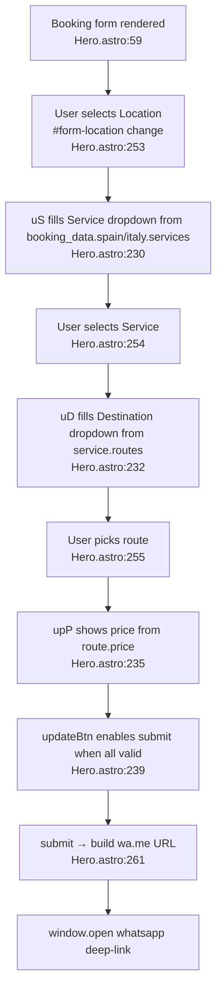

# Booking Form Flowchart (F3)

Happy path: user fills form → WhatsApp message opens.

**Side effects:** `window.open` to `wa.me/<phone>?text=<urlencoded booking>`. Also has `data-netlify="true"` (Hero.astro:59) — Netlify Forms POST backup.

**Validation (Hero.astro:209-210):** `validName` Unicode letters/space/hyphen/apostrophe ≥2 chars; `validPhone` strips `[\s\-+()]`, 7-15 digits, `+`/digits/space/`-`/`()` charset. Errors injected as `.field-error` divs, `data-invalid` attr.

**Data dependency:** `booking_data` from `page-content` collection (F1), passed via `SCRIPT_DATA` `define:vars` (Hero.astro:9-21, 196).
