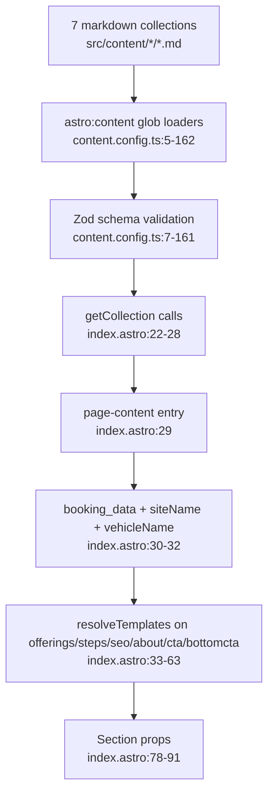

# Content Data Layer Flowchart (F1 + F2)

Happy path: markdown → Zod validation → index.astro → template resolution → section props.

**Placeholder map (templates.js:28-37):**
- `{location1}` → spain.short_label, `{location2}` → italy.short_label
- `{location1_full}` → spain.label, `{location2_full}` → italy.label
- `{location1_name}` → spain.region, `{location2_name}` → italy.region
- `{site_name}` → `VIPER Security`, `{vehicle}` → `Mercedes-Benz S-Class` (vehicle_name)

**Resolution order:** `replaceAll` per key; keys with empty value skipped (templates.js:39-43). Applied to both collection data AND page-content prose fields (index.astro:52-63) — two separate resolution passes.

**Side effects:** none at runtime — pure build-time. Content validated at build; invalid data fails `astro build`.

**External deps:** none (astro:content). CMS (F7) is the write path; this is read path.
