# Section Rendering Flowchart (F4)

Happy path: index.astro props → 13 section components → static HTML.

```mermaid
flowchart TD
    A[index.astro:78-91] --> B[Nav.astro<br/>brandName]
    A --> C[Hero.astro<br/>subtitle, cta, hero_image, phones]
    A --> D[Marquee.astro<br/>static string]
    A --> E[AboutSection.astro<br/>about]
    A --> F[Services.astro<br/>marbella=milano=allOfferings]
    A --> G[Fleet.astro<br/>vehicles + fleetFeatures]
    A --> H[StatsSection.astro<br/>stats]
    A --> I[HowItWorks.astro<br/>steps]
    A --> J[Pricing.astro<br/>hourly]
    A --> K[Membership.astro<br/>tiers]
    A --> L[CtaBanner.astro<br/>cta]
    A --> M[BottomCta.astro<br/>bottomcta]
    A --> N[Footer.astro<br/>phones, brandName]
    A --> O[BaseLayout.astro<br/>SEO + JSON-LD shell]
```

**Data flow pattern:** every section is pure presentation — receives resolved data as props, no internal data fetching. `pageContent` prop threaded to 12 of 13 sections (Marquee is only static one, uses `s.marquee.text`).

**Shared pattern — scroll reveal:** sections add `data-scroll-reveal` attr; BaseLayout.astro:90-104 single IntersectionObserver sets `data-scroll-reveal-visible`. Not per-section JS.

**Section-local styles:** `<style>` blocks co-located. Recurring `:root{--colors--gold-bright:#c8a04c}` override (see duplication report).

**External deps:** ICONS from `src/config/icons.js` via `set:html` (Nav, Hero, About, Stats, CtaBanner, BottomCta, Footer, Services).
