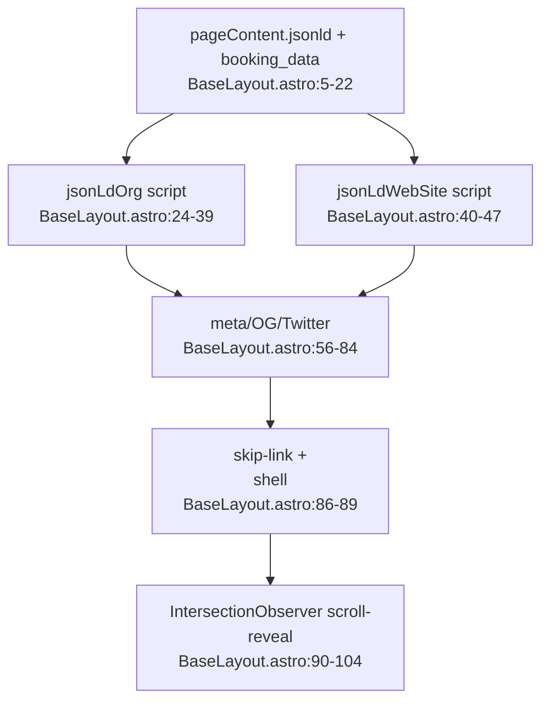

# SEO / JSON-LD / Shell Flowchart (F6)

Happy path: page-content jsonld + seo → head meta + JSON-LD scripts.

**Key data:** Org JSON-LD uses `org_name/org_url/org_logo/org_description/phoneSpain/phoneItaly/privacy_policy` from `page-content.jsonld` (content.md:2-9), with `spainLocality`/`italyLocality` fallbacks from booking_data short_labels (BaseLayout.astro:21-22). Phones fall back to `s.jsonld.phone*` (empty in strings.js:33-34).

**Notable:** `ogImageUrl` hardcodes `/images/hero-image.webp` (BaseLayout.astro:8) — **this file doesn't exist** (images dir has `hero-image_upscaled.webp`). Stale reference. Same for `<meta content={seo?.title} property="og:title">` — uses pageContent seo, correct.

**External deps:** Google Fonts (Work Sans, Noto Serif, Playfair Display), `/styles/global.css`.
